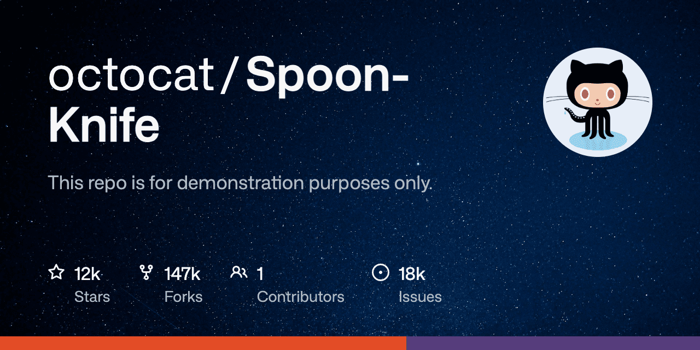

>[!WARNING]
> The image generator is working but the GitHub action to update the OG image for the repo is not functional. As of December 2024, the GitHub API doesn't have a feature update the Social Media Preview for a repository. A hacky puppeteer-based workaround could be implemented as a proof of concept, but this is a show stopper for any robust use case. Please upvote this [feature request](https://github.com/orgs/community/discussions/32166) and I will revisit this project if/when this feature is added to the API.

This node.js tool generates a custom [OpenGraph](https://www.opengraph.xyz/) image that displays the repository details and stats. Your can choose what elements are included in the image and even use a custom background.



The image is generated using [puppeteer](https://github.com/GoogleChrome/puppeteer) and [sharp](https://github.com/lovell/sharp). The method is inspired by [this post](https://github.blog/open-source/git/framework-building-open-graph-images/) on the GitHub blog.

## Usage

### Configuration

Edit `config.yml` to configure the image generation parameters. You can set the source repository and define the elements to be included in the image. Refer to the comments in the file for guidance.

### Local Setup

Create a new GitHub token [here](https://github.com/settings/tokens) with read_repo permissions and add it to the `.env` file.

Create a `.env` file in the root directory containing the following:
```
GITHUB_TOKEN=<your github token>
```
Use the actual GitHub token instead of `<your github token>`.

> [!WARNING]
> Make sure to add `.env` to your `.gitignore` file to avoid accidentally committing your token to the repository.

### Local Usage

1. run `npm install` to install the dependencies.
2. run `npm run generate` to generate the image.

### Custom template

If you know html/css and want to use a custom template, you can edit `template.html` to customize the layout, or create a new template and update the `templatePath` in `config.yml`.

### GitHub Actions Configuration

1. Set GITHUB_TOKEN Permissions:
- Go to repository `Settings → Actions → General → Workflow permissions`.
- Enable: Read and write permissions.
- Click `Save`.

At the moment of writing, the GitHub API doesn't have a feature update the Social Media Preview for the repository (though there is a feature request you can upvote [here](https://github.com/orgs/community/discussions/32166)). 

> [!WARNING]
> The workaround described below is not functional. Attempts to log in from the virtual environment of a GitHub Workflow triggers email 2FA. I briefly considered the possibility of having the bot fetch the OTP from an email—and I might still do it if my better judgment gets distracted long enough—but on a regular day, this is a level of rubber band and chewing gum even I am uncomfortable with.
 
~~As a workaround, we are using Puppeteer and a dedicated bot account to update the image. Why a separate account? Because we need to add login information to the repository secrets and it is not advisable to store your own credentials in there, even if they are supposed to stay hidden.~~

~~This workaround also means the repository needs to belong to an organisation, as this is the only way to give the bot account access to the settings for the repository.~~

~~1. Create a dedicated bot account~~
~~2. Create a new [GitHub organization](https://github.com/settings/organizations) (it can be a free organization account) if you don't have one already~~
~~3. Add the repository to your organisation~~
~~4. Add the bot account as a collaborator with the 'Write' permission to the repository~~
~~5. Create a `BOT_GITHUB_USERNAME` repository variable containing the bot account's username~~
~~6. Create a `BOT_GITHUB_PASSWORD` repository **secret** containing the bot account's password~~

## References

- [A framework for building Open Graph images](https://github.blog/open-source/git/framework-building-open-graph-images/)
- [Custom Open Graph Images for repositories (GitHub Blog)](https://github.blog/news-insights/product-news/custom-open-graph-images-for-repositories/)
- [Octicons](https://primer.style/foundations/icons). A scalable set of icons handcrafted by GitHub.
- [Mona Sans](https://github.com/github/mona-sans). A free, open source, sans serif typeface used by GitHub.

## Similar Projects

- https://github.com/potatoqualitee/ogimage